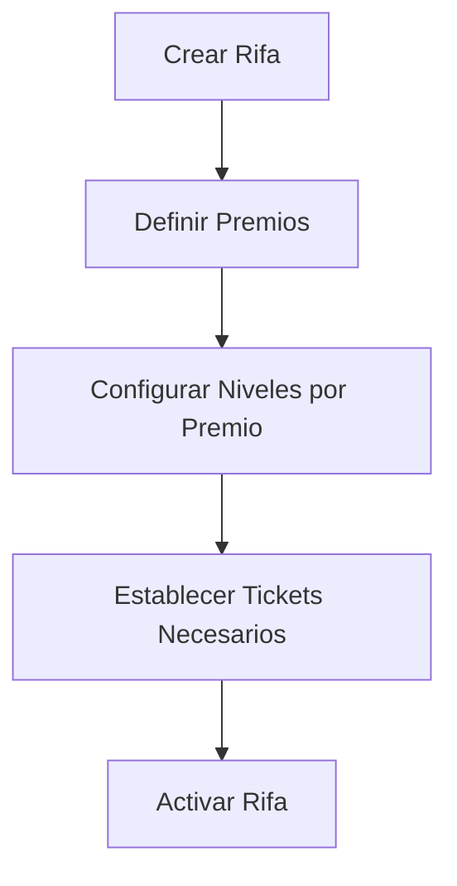
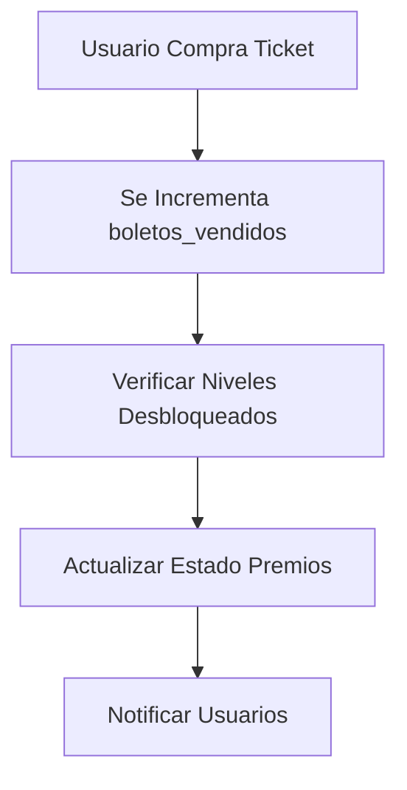

# 🎯 Danilore Rifas - Sistema de Rifas Online

Sistema completo de rifas online con **premios progresivos** usando Laravel + Vue.js + MySQL con Docker.

## 📋 Descripción del Sistema

**Danilore Rifas** es una plataforma de rifas online con un innovador sistema de **premios progresivos** donde los usuarios pueden desbloquear diferentes premios a medida que se venden más tickets. Cada rifa puede tener múltiples premios con niveles que se van desbloqueando progresivamente.

### 🎮 Características Principales

- **Sistema de Premios Progresivos**: Los premios se desbloquean según la cantidad de tickets vendidos
- **Niveles por Premio**: Cada premio tiene niveles que se van completando gradualmente
- **Galería Multimedia**: Soporte para imágenes y videos de alta calidad
- **Pagos Integrados**: Yape, Plin, transferencias bancarias
- **Dashboard Administrativo**: Panel completo para gestión de rifas
- **Notificaciones en Tiempo Real**: Email, SMS y WhatsApp
- **Sistema de Auditoría**: Registro completo de todas las acciones


## 🗄️ Estructura de la Base de Datos

### � **Tipos de Documento Soportados**

El sistema soporta múltiples tipos de documentos para hacerlo internacional y flexible:

- **DNI**: Documento Nacional de Identidad (Perú) - 8 dígitos
- **CE**: Carné de Extranjería (Perú) - Hasta 20 caracteres
- **Passport**: Pasaporte internacional - Hasta 20 caracteres  
- **RUC**: Registro Único de Contribuyentes (empresas) - 11 dígitos
- **Otros**: Otros tipos de documento no especificados

### �👤 **Tabla: `users`**
```sql
- id (BIGINT, PK)
- name (VARCHAR)
- email (VARCHAR, UNIQUE)
- password (VARCHAR)
- telefono (VARCHAR, 15)
- tipo_documento (ENUM: dni, ce, passport, ruc, otros) DEFAULT 'dni'
- numero_documento (VARCHAR, 20)
- fecha_nacimiento (DATE)
- genero (ENUM: masculino, femenino, otro)
- direccion (VARCHAR)
- ciudad (VARCHAR, 100)
- departamento (VARCHAR, 100)
- codigo_postal (VARCHAR, 10)
- rol (ENUM: admin, usuario) DEFAULT 'usuario'
- activo (BOOLEAN) DEFAULT true
- ultimo_acceso (DATETIME)
- avatar (VARCHAR)
- notif_email (BOOLEAN) DEFAULT true
- notif_sms (BOOLEAN) DEFAULT false
- notif_whatsapp (BOOLEAN) DEFAULT true
- total_boletos_comprados (INT) DEFAULT 0
- total_gastado (DECIMAL 12,2) DEFAULT 0
- rifas_ganadas (INT) DEFAULT 0
- timestamps
```

### 🎰 **Tabla: `rifas`**
```sql
- id (BIGINT, PK)
- titulo (VARCHAR)
- descripcion (TEXT)
- precio_boleto (DECIMAL 10,2)
- boletos_minimos (INT) # Tickets mínimos para confirmar la rifa
- boletos_vendidos (INT) DEFAULT 0
- imagen_principal (VARCHAR)
- imagenes_adicionales (JSON)
- media_gallery (JSON) # Múltiples medios
- fecha_inicio (DATE)
- fecha_fin (DATE)
- fecha_sorteo (DATETIME)
- estado (ENUM: en_venta, confirmada, sorteada, cancelada) DEFAULT 'en_venta'
- tipo (ENUM: actual, futura) DEFAULT 'futura'
- categoria_id (BIGINT, FK)
- codigo_unico (VARCHAR, 20, UNIQUE)
- es_destacada (BOOLEAN) DEFAULT false
- max_boletos_por_persona (INT) DEFAULT 10
- terminos_condiciones (TEXT)
- orden (INT) DEFAULT 1 # Para ordenar rifas futuras
- rifa_requerida_id (BIGINT, FK) # Rifa que debe completarse antes
- notas_admin (TEXT)
- timestamps
```

### 🏆 **Tabla: `premios`**
```sql
- id (BIGINT, PK)
- rifa_id (BIGINT, FK)
- codigo (VARCHAR, 10) # p1, p2, p3, etc.
- titulo (VARCHAR)
- descripcion (TEXT)
- imagen_principal (VARCHAR)
- media_gallery (JSON) # Imágenes y videos adicionales
- orden (INT) # Orden del premio (1, 2, 3...)
- premio_requerido_id (BIGINT, FK) # Premio que debe completarse antes
- estado (ENUM: bloqueado, activo, completado) DEFAULT 'bloqueado'
- desbloqueado (BOOLEAN) DEFAULT false
- fecha_desbloqueo (DATETIME)
- fecha_completado (DATETIME)
- notas_admin (TEXT)
- timestamps
```

### 📊 **Tabla: `niveles`**
```sql
- id (BIGINT, PK)
- premio_id (BIGINT, FK)
- codigo (VARCHAR, 10) # n1, n2, n3, etc.
- titulo (VARCHAR)
- descripcion (TEXT)
- tickets_necesarios (INT) # Tickets necesarios para desbloquear
- valor_aproximado (DECIMAL 12,2) # Valor estimado del nivel
- imagen (VARCHAR)
- orden (INT) # Orden dentro del premio (1, 2, 3...)
- desbloqueado (BOOLEAN) DEFAULT false
- es_actual (BOOLEAN) DEFAULT false # Si es el nivel activo actualmente
- fecha_desbloqueo (DATETIME)
- especificaciones (TEXT) # JSON con especificaciones técnicas
- timestamps
```

### 🛒 **Tabla: `ventas`**
```sql
- id (BIGINT, PK)
- user_id (BIGINT, FK)
- rifa_id (BIGINT, FK)
- codigo_venta (VARCHAR, 20, UNIQUE)
- cantidad_boletos (INT)
- subtotal (DECIMAL 12,2)
- descuento (DECIMAL 12,2) DEFAULT 0
- total (DECIMAL 12,2)
- estado (ENUM: pendiente, pagada, cancelada, expirada) DEFAULT 'pendiente'
- metodo_pago (ENUM: yape, plin, transferencia, efectivo)
- fecha_expiracion (DATETIME) # Para reservas temporales
- notas_cliente (TEXT)
- notas_admin (TEXT)
- comprador_nombre (VARCHAR)
- comprador_email (VARCHAR)
- comprador_telefono (VARCHAR)
- comprador_tipo_documento (ENUM: dni, ce, passport, ruc, otros) DEFAULT 'dni'
- comprador_numero_documento (VARCHAR, 20)
- referencia_pago (VARCHAR)
- fecha_pago (DATETIME)
- monto_pagado (DECIMAL 12,2)
- comprobante_pago (VARCHAR) # URL del comprobante
- timestamps
```

### 🎫 **Tabla: `boletos`**
```sql
- id (BIGINT, PK)
- rifa_id (BIGINT, FK)
- user_id (BIGINT, FK)
- venta_id (BIGINT, FK)
- numero (VARCHAR, 10) # Número del boleto
- precio_pagado (DECIMAL 10,2)
- estado (ENUM: reservado, pagado, cancelado) DEFAULT 'reservado'
- fecha_reserva (DATETIME)
- fecha_expiracion_reserva (DATETIME)
- fecha_pago (DATETIME)
- codigo_verificacion (VARCHAR, 50, UNIQUE)
- es_ganador (BOOLEAN) DEFAULT false
- timestamps
```

### 💳 **Tabla: `pagos`**
```sql
- id (BIGINT, PK)
- venta_id (BIGINT, FK)
- metodo_pago (VARCHAR) # yape, plin, transferencia, efectivo
- monto (DECIMAL 12,2)
- referencia_externa (VARCHAR) # ID de transacción del banco/app
- numero_operacion (VARCHAR)
- fecha_transaccion (DATETIME)
- estado (ENUM: pendiente, verificado, rechazado) DEFAULT 'pendiente'
- comprobante_url (VARCHAR) # URL del comprobante subido
- notas_verificacion (TEXT)
- verificado_por (BIGINT, FK) # Admin que verificó
- fecha_verificacion (DATETIME)
- datos_pago (JSON) # Datos específicos según el método
- timestamps
```

### 🏷️ **Tabla: `categorias`**
```sql
- id (BIGINT, PK)
- nombre (VARCHAR, 100)
- slug (VARCHAR, 100, UNIQUE)
- descripcion (TEXT)
- icono (VARCHAR, 50)
- color (VARCHAR, 7) DEFAULT '#8B5CF6'
- activa (BOOLEAN) DEFAULT true
- orden (INT) DEFAULT 0
- timestamps
```

### 🔧 **Tabla: `configuraciones`**
```sql
- id (BIGINT, PK)
- clave (VARCHAR, 100, UNIQUE)
- valor (TEXT)
- tipo (VARCHAR, 50) DEFAULT 'string' # string, number, boolean, json
- grupo (VARCHAR, 50) # general, pagos, notificaciones, etc.
- descripcion (TEXT)
- editable (BOOLEAN) DEFAULT true
- timestamps
```

### 🔔 **Tabla: `notificaciones`**
```sql
- id (BIGINT, PK)
- user_id (BIGINT, FK)
- titulo (VARCHAR)
- mensaje (TEXT)
- tipo (ENUM: info, success, warning, error) DEFAULT 'info'
- canal (ENUM: sistema, email, sms, whatsapp) DEFAULT 'sistema'
- datos_adicionales (JSON) # Para datos específicos como rifa_id, venta_id, etc.
- leida (BOOLEAN) DEFAULT false
- fecha_leida (DATETIME)
- enviada (BOOLEAN) DEFAULT false
- fecha_envio (DATETIME)
- error_envio (TEXT)
- referencia_externa (VARCHAR) # ID del servicio de envío
- timestamps
```

### 📈 **Tabla: `progreso_premios`**
```sql
- id (BIGINT, PK)
- premio_id (BIGINT, FK)
- nivel_id (BIGINT, FK) # NULL si es progreso general del premio
- tickets_actuales (INT) DEFAULT 0
- tickets_objetivo (INT)
- porcentaje_completado (DECIMAL 5,2) DEFAULT 0 # 0.00 - 100.00
- objetivo_alcanzado (BOOLEAN) DEFAULT false
- fecha_alcanzado (DATETIME)
- ultimo_ticket (DATETIME) # Fecha del último ticket que contribuyó
- tickets_restantes (VIRTUAL) # tickets_objetivo - tickets_actuales
- timestamps
```

### 🕵️ **Tabla: `auditoria`**
```sql
- id (BIGINT, PK)
- tabla_afectada (VARCHAR) # Nombre de la tabla
- accion (VARCHAR) # INSERT, UPDATE, DELETE
- registro_id (BIGINT) # ID del registro afectado
- user_id (BIGINT, FK) # Usuario que realizó la acción
- datos_anteriores (JSON) # Datos antes del cambio
- datos_nuevos (JSON) # Datos después del cambio
- ip_address (VARCHAR, 45) # IP del usuario
- user_agent (VARCHAR) # Navegador del usuario
- observaciones (TEXT) # Comentarios adicionales
- timestamps
```

## 🏗️ Arquitectura del Sistema

### **Frontend (Vue.js 3)**
```
frontend/
├── src/
│   ├── components/          # Componentes reutilizables
│   │   ├── AppHeader.vue
│   │   ├── AppFooter.vue
│   │   ├── MediaGallery.vue
│   │   └── ProgressBar.vue
│   ├── views/               # Páginas principales
│   │   ├── Home.vue
│   │   ├── RifaDetail.vue
│   │   ├── PremioDetail.vue
│   │   ├── Dashboard.vue
│   │   └── Login.vue
│   ├── composables/         # Lógica reutilizable
│   │   ├── useRifaDetail.js
│   │   └── useAuth.js
│   ├── services/            # Servicios API
│   │   └── rifaService.js
│   ├── store/               # Estado global
│   │   └── auth.js
│   ├── router/              # Configuración de rutas
│   │   └── index.js
│   └── utils/               # Utilidades
│       └── helpers.js
```

### **Backend (Laravel 12)**
```
backend/
├── app/
│   ├── Http/Controllers/    # Controladores API
│   │   ├── RifaController.php
│   │   ├── PremioController.php
│   │   ├── VentaController.php
│   │   └── AuthController.php
│   ├── Models/              # Modelos Eloquent
│   │   ├── Rifa.php
│   │   ├── Premio.php
│   │   ├── Nivel.php
│   │   ├── Venta.php
│   │   ├── Boleto.php
│   │   └── User.php
│   ├── Services/            # Lógica de negocio
│   │   ├── RifaService.php
│   │   ├── PagoService.php
│   │   └── NotificationService.php
│   └── Observers/           # Observadores para auditoría
├── database/
│   ├── migrations/          # Migraciones de BD
│   └── seeders/             # Datos iniciales
└── routes/
    └── api.php              # Rutas API
```

## � Flujo del Sistema de Premios Progresivos

### **1. Configuración de Rifa**


### **2. Proceso de Venta**


### **3. Estados de Premio**
- **Bloqueado**: No se han vendido suficientes tickets
- **Activo**: Tickets suficientes para el nivel actual
- **Completado**: Todos los niveles completados

## 🎯 Funcionalidades Implementadas

### **Frontend**
- ✅ **Home**: Vista principal con rifas activas y futuras
- ✅ **RifaDetail**: Detalle de rifa con premios progresivos
- ✅ **PremioDetail**: Vista individual de cada premio
- ✅ **MediaGallery**: Galería multimedia responsiva
- ✅ **Sistema de Pagos**: Integración con Yape/Plin

### **Backend API**
- ✅ **Autenticación**: Login/registro con Laravel Sanctum
- ✅ **Gestión de Rifas**: CRUD completo con filtros
- ✅ **Sistema de Ventas**: Reserva y compra de boletos
- ✅ **Progreso de Premios**: Tracking en tiempo real
- ✅ **Categorías**: Organización de rifas

## 🚀 API Endpoints

### **Base URL**: `http://localhost:8000/api/v1`

### 🔓 **Endpoints Públicos**

#### **Autenticación**
```http
POST /auth/register          # Registro de usuario
POST /auth/login             # Iniciar sesión
```

**Ejemplo de registro:**
```json
POST /api/v1/auth/register
{
  "name": "Juan Pérez",
  "email": "juan@email.com",
  "password": "12345678",
  "password_confirmation": "12345678",
  "telefono": "+51987654321",
  "tipo_documento": "dni",
  "numero_documento": "12345678"
}
```

**Respuesta:**
```json
{
  "success": true,
  "message": "Usuario registrado correctamente",
  "data": {
    "user": { ... },
    "token": "1|abc123..."
  }
}
```

#### **Rifas**
```http
GET /rifas                   # Listar todas las rifas
GET /rifas/actuales         # Rifas en venta
GET /rifas/futuras          # Rifas por venir  
GET /rifas/destacadas       # Rifas destacadas
GET /rifas/{codigo}         # Detalle de rifa
GET /rifas/{codigo}/progreso # Progreso de premios
```

**Parámetros de consulta:**
- `categoria_id`: Filtrar por categoría
- `tipo`: `actual` o `futura`
- `estado`: `en_venta`, `confirmada`, etc.
- `destacadas`: `true` para rifas destacadas
- `per_page`: Número de resultados por página

**Ejemplo:**
```http
GET /api/v1/rifas/actuales?categoria_id=1&per_page=10
```

**Respuesta:**
```json
{
  "success": true,
  "data": {
    "current_page": 1,
    "data": [
      {
        "id": 1,
        "titulo": "iPhone 15 Pro Max",
        "codigo_unico": "IPHONE15PM001",
        "precio_boleto": "10.00",
        "boletos_vendidos": 35,
        "categoria": { ... },
        "premios": [
          {
            "titulo": "AirPods Pro",
            "niveles": [ ... ]
          }
        ]
      }
    ],
    "total": 2
  }
}
```

#### **Categorías**
```http
GET /categorias             # Listar categorías activas
```

#### **Consulta de Ventas**
```http
GET /ventas/{codigo}        # Consultar venta por código
```

### 🔐 **Endpoints Autenticados**
*Requieren header: `Authorization: Bearer {token}`*

#### **Perfil de Usuario**
```http
POST /auth/logout           # Cerrar sesión
GET /auth/profile          # Obtener perfil
PUT /auth/profile          # Actualizar perfil
```

#### **Ventas**
```http
POST /ventas               # Crear nueva venta (reservar boletos)
POST /ventas/{codigo}/confirmar-pago # Subir comprobante
GET /ventas/mis-ventas     # Mis compras
```

**Ejemplo de compra:**
```json
POST /api/v1/ventas
{
  "rifa_codigo": "IPHONE15PM001",
  "numeros_boletos": ["0001", "0025", "0100"],
  "comprador_nombre": "Juan Pérez",
  "comprador_email": "juan@email.com", 
  "comprador_telefono": "+51987654321",
  "comprador_tipo_documento": "dni",
  "comprador_numero_documento": "12345678",
  "metodo_pago": "yape"
}
```

**Respuesta:**
```json
{
  "success": true,
  "message": "Venta creada correctamente",
  "data": {
    "codigo_venta": "VT20250725ABC123",
    "total": "30.00",
    "fecha_expiracion": "2025-07-25T10:15:00Z",
    "boletos": [
      {
        "numero": "0001",
        "codigo_verificacion": "A1B2C3D4E5"
      }
    ]
  }
}
```

**Confirmar pago:**
```http
POST /api/v1/ventas/VT20250725ABC123/confirmar-pago
Content-Type: multipart/form-data

numero_operacion: "123456789"
monto_pagado: "30.00"
comprobante: [archivo imagen]
```

### 📊 **Códigos de Respuesta**

- `200` - OK: Operación exitosa
- `201` - Created: Recurso creado
- `401` - Unauthorized: Token inválido o expirado
- `403` - Forbidden: Sin permisos
- `404` - Not Found: Recurso no encontrado
- `409` - Conflict: Números ya ocupados
- `410` - Gone: Venta expirada
- `422` - Validation Error: Datos incorrectos
- `500` - Server Error: Error interno

### 🔒 **Autenticación**

El sistema usa **Laravel Sanctum** para autenticación API:

1. **Registro/Login** → Recibir token
2. **Incluir en headers**: `Authorization: Bearer {token}`
3. **Token expira** cuando el usuario hace logout

### ⚡ **Características Avanzadas**

- **Reserva temporal**: Números reservados por 15 minutos
- **Verificación en tiempo real**: Disponibilidad de números
- **Upload de archivos**: Comprobantes de pago
- **Paginación automática**: En listados
- **Filtros avanzados**: Por categoría, estado, etc.
- **Relaciones optimizadas**: Carga eager loading
- **Validaciones robustas**: En todos los endpoints
- ✅ **Autenticación**: Login/Register con persistencia
- ✅ **Dashboard**: Panel de usuario con historial
- ✅ **Responsive Design**: Optimizado para móviles

### **Backend** (Estructura preparada)
- 🔧 **API REST**: Endpoints para todas las funcionalidades
- 🔧 **Sistema de Premios**: Lógica de desbloqueo progresivo
- 🔧 **Gestión de Pagos**: Verificación y procesamiento
- 🔧 **Notificaciones**: Email, SMS y WhatsApp
- 🔧 **Auditoría**: Registro de todas las acciones
- 🔧 **Dashboard Admin**: Panel administrativo completo

## 🔐 Seguridad y Validaciones

### **Frontend**
- Validación de formularios con Vue 3
- Sanitización de datos de entrada
- Control de acceso por roles
- Persistencia segura en localStorage

### **Backend**
- Validación de datos con Laravel Request
- Middleware de autenticación JWT
- Rate limiting en APIs
- Auditoría completa de acciones
- Encriptación de datos sensibles

## 📱 Responsive Design

El sistema está optimizado para:
- **Desktop**: 1200px+ (Grid 2fr 1fr)
- **Tablet**: 769px-1199px (Grid compacto)
- **Mobile**: ≤768px (Layout en columna única)

## �🚀 Instalación y Configuración

### Pre-requisitos
- Docker Desktop
- Docker Compose
- Git

### 🔧 Configuración Inicial

1. **Clonar el repositorio:**
```bash
git clone <repository-url>
cd danilore-rifas
```

2. **Configurar variables de entorno:**
```bash
# El archivo .env del backend ya está configurado
# Verificar configuración en backend/.env
```

3. **Construir y levantar los servicios:**
```bash
docker-compose up --build -d
```

4. **Ejecutar migraciones:**
```bash
docker exec danilore_backend php artisan migrate
docker exec danilore_backend php artisan db:seed
```

## 📊 Servicios Disponibles

| Servicio | Puerto | URL | Descripción |
|----------|--------|-----|-------------|
| Frontend | 3000 | http://localhost:3000 | Aplicación Vue.js |
| Backend | 8000 | http://localhost:8000 | API Laravel |
| MySQL | 3306 | localhost:3306 | Base de datos |
| phpMyAdmin | 8080 | http://localhost:8080 | Gestión de BD |

## 🗄️ Base de Datos

### Credenciales MySQL:
- **Host:** localhost:3306
- **Database:** danilore_rifas
- **Usuario:** danilore
- **Contraseña:** danilore123
- **Root Password:** root123

### phpMyAdmin:
- **URL:** http://localhost:8080
- **Usuario:** danilore
- **Contraseña:** danilore123

## 🛠️ Comandos Útiles

### Docker
```bash
# Levantar servicios
docker-compose up -d

# Ver logs
docker-compose logs -f

# Detener servicios
docker-compose down

# Reconstruir contenedores
docker-compose up --build
```

### Laravel (Backend)
```bash
# Ejecutar comandos artisan
docker exec danilore_backend php artisan migrate
docker exec danilore_backend php artisan db:seed
docker exec danilore_backend php artisan cache:clear

# Acceder al contenedor
docker exec -it danilore_backend bash
```

### Vue.js (Frontend)
```bash
# Instalar dependencias
docker exec danilore_frontend npm install

# Acceder al contenedor
docker exec -it danilore_frontend sh
```

## � Servicios Disponibles

| Servicio | Puerto | URL | Descripción |
|----------|--------|-----|-------------|
| Frontend | 3000 | http://localhost:3000 | Aplicación Vue.js |
| Backend | 8000 | http://localhost:8000 | API Laravel |
| MySQL | 3306 | localhost:3306 | Base de datos |
| phpMyAdmin | 8080 | http://localhost:8080 | Gestión de BD |

## 🗄️ Base de Datos

### Credenciales MySQL:
- **Host:** localhost:3306
- **Database:** danilore_rifas
- **Usuario:** danilore
- **Contraseña:** danilore123
- **Root Password:** root123

### phpMyAdmin:
- **URL:** http://localhost:8080
- **Usuario:** danilore
- **Contraseña:** danilore123

## 🛠️ Comandos Útiles

### Docker
```bash
# Levantar servicios
docker-compose up -d

# Ver logs
docker-compose logs -f

# Detener servicios
docker-compose down

# Reconstruir contenedores
docker-compose up --build
```

### Laravel (Backend)
```bash
# Ejecutar comandos artisan
docker exec danilore_backend php artisan migrate
docker exec danilore_backend php artisan db:seed
docker exec danilore_backend php artisan cache:clear

# Acceder al contenedor
docker exec -it danilore_backend bash
```

### Vue.js (Frontend)
```bash
# Instalar dependencias
docker exec danilore_frontend npm install

# Ejecutar en modo desarrollo
docker exec danilore_frontend npm run serve

# Acceder al contenedor
docker exec -it danilore_frontend sh
```

## 🎮 Cómo Funciona el Sistema

### **Concepto de Premios Progresivos**

El sistema funciona con un **modelo de premios progresivos** donde:

1. **Una rifa tiene múltiples premios** (Ej: p1, p2, p3)
2. **Cada premio tiene múltiples niveles** (Ej: n1, n2, n3)
3. **Los premios se desbloquean secuencialmente** según los tickets vendidos
4. **Los niveles dentro de un premio se completan gradualmente**

### **Ejemplo Práctico: Rifa PlayStation 5**

```
🎰 RIFA: PlayStation 5 y Accesorios
├── 🏆 Premio 1: Accesorios Gaming (p1)
│   ├── 📦 Nivel 1: Auriculares Gaming (20 tickets)
│   └── 📦 Nivel 2: Control Adicional (30 tickets)
├── 🏆 Premio 2: Juegos Exclusivos (p2) [Requiere p1 completado]
│   ├── 📦 Nivel 1: God of War (40 tickets)
│   ├── 📦 Nivel 2: Spider-Man 2 (50 tickets)
│   └── 📦 Nivel 3: The Last of Us (60 tickets)
└── 🏆 Premio 3: PlayStation 5 Console (p3) [Requiere p2 completado]
    ├── 📦 Nivel 1: Console Estándar (70 tickets)
    └── 📦 Nivel 2: Bundle Completo (75 tickets)
```

### **Flujo de Desbloqueo**

1. **0-19 tickets**: Todos los premios bloqueados
2. **20 tickets**: Se desbloquea Auriculares Gaming (p1-n1)
3. **30 tickets**: Se completa Control Adicional (p1-n2) → Premio 1 completado
4. **40 tickets**: Se desbloquea God of War (p2-n1)
5. **50 tickets**: Se desbloquea Spider-Man 2 (p2-n2)
6. **60 tickets**: Se completa The Last of Us (p2-n3) → Premio 2 completado
7. **70 tickets**: Se desbloquea PlayStation 5 (p3-n1)
8. **75 tickets**: Se completa Bundle Completo (p3-n2) → **RIFA CONFIRMADA**

## 🎯 API Endpoints (Backend)

### **Rifas**
```
GET    /api/rifas              # Listar todas las rifas
GET    /api/rifas/{id}         # Obtener rifa específica
POST   /api/rifas              # Crear nueva rifa [Admin]
PUT    /api/rifas/{id}         # Actualizar rifa [Admin]
DELETE /api/rifas/{id}         # Eliminar rifa [Admin]
```

### **Premios**
```
GET    /api/rifas/{rifaId}/premios           # Premios de una rifa
GET    /api/premios/{id}                     # Premio específico
POST   /api/rifas/{rifaId}/premios           # Crear premio [Admin]
PUT    /api/premios/{id}                     # Actualizar premio [Admin]
```

### **Niveles**
```
GET    /api/premios/{premioId}/niveles       # Niveles de un premio
POST   /api/premios/{premioId}/niveles       # Crear nivel [Admin]
PUT    /api/niveles/{id}                     # Actualizar nivel [Admin]
```

### **Ventas y Boletos**
```
POST   /api/rifas/{id}/comprar              # Comprar tickets
GET    /api/ventas/mis-compras               # Historial de compras [Auth]
GET    /api/boletos/mis-boletos              # Mis boletos [Auth]
POST   /api/pagos/confirmar                  # Confirmar pago
```

### **Autenticación**
```
POST   /api/auth/register                    # Registro de usuario
POST   /api/auth/login                       # Iniciar sesión
POST   /api/auth/logout                      # Cerrar sesión [Auth]
GET    /api/auth/me                          # Perfil del usuario [Auth]
```

## 🎨 Componentes Frontend

### **Componentes Principales**

#### **MediaGallery.vue**
- Galería multimedia responsiva
- Soporte para imágenes y videos
- Navegación con thumbnails
- Modal fullscreen
- Lazy loading

#### **ProgressBar.vue**
- Barra de progreso animada
- Indicadores de niveles
- Estados visuales (completado, actual, pendiente)

#### **PremioCard.vue**
- Tarjeta de premio con estado
- Indicador de desbloqueo
- Progreso de niveles
- Botón de participación

### **Vistas (Views)**

#### **Home.vue**
- Lista de rifas activas y futuras
- Filtros por categoría y estado
- Cards responsivas
- Call-to-action principales

#### **RifaDetail.vue**
- Información completa de la rifa
- Lista de premios progresivos
- Sistema de compra de tickets
- Modal de pago integrado

#### **PremioDetail.vue**
- Vista individual del premio
- Galería multimedia
- Detalle de niveles
- Estado de participación

#### **Dashboard.vue**
- Panel del usuario
- Historial de compras
- Boletos activos
- Estadísticas personales

## 🔧 Servicios y Composables

### **rifaService.js**
```javascript
// Gestión de datos de rifas
class RifaService {
  calcularEstadosPremios(rifa)     // Calcula estados de premios
  obtenerRifaActual()              // Obtiene rifa en curso
  obtenerRifasFuturas()            // Obtiene rifas programadas
  calcularProgreso(tickets, meta)   // Calcula porcentaje de progreso
}
```

### **useRifaDetail.js**
```javascript
// Composable para lógica de rifas
export function useRifaDetail() {
  const rifa = ref(null)
  const loading = ref(false)
  const error = ref(null)
  
  const loadRifa = (id) => { /* ... */ }
  const getPremiosProgresivos = () => { /* ... */ }
  const showPaymentModal = () => { /* ... */ }
  const confirmPayment = () => { /* ... */ }
}
```

### **useAuth.js**
```javascript
// Composable para autenticación
export function useAuth() {
  const user = ref(null)
  const isAuthenticated = ref(false)
  
  const login = (credentials) => { /* ... */ }
  const logout = () => { /* ... */ }
  const register = (userData) => { /* ... */ }
}
```

## 📱 Estados del Sistema

### **Estados de Rifa**
- `en_venta`: Rifa activa recibiendo compras
- `confirmada`: Meta mínima alcanzada, rifa garantizada
- `sorteada`: Sorteo realizado, ganadores seleccionados
- `cancelada`: Rifa cancelada, reembolsos procesados

### **Estados de Premio**
- `bloqueado`: Premio no disponible (tickets insuficientes)
- `activo`: Premio disponible para desbloqueo
- `completado`: Todos los niveles del premio completados

### **Estados de Boleto**
- `reservado`: Boleto reservado temporalmente
- `pagado`: Pago confirmado, boleto válido
- `cancelado`: Reserva expirada o cancelada

### **Estados de Venta**
- `pendiente`: Venta creada, esperando pago
- `pagada`: Pago confirmado y verificado
- `cancelada`: Venta cancelada por el usuario
- `expirada`: Tiempo de pago agotado

## 🔐 Validaciones Frontend vs Backend

### **Campos de Usuario (users)**
```javascript
// Frontend (Register.vue, Dashboard.vue)
{
  name: 'string|required|min:2|max:100',
  email: 'email|required|unique',
  telefono: 'string|max:15',
  dni: 'string|max:8',
  fecha_nacimiento: 'date',
  genero: 'enum:masculino,femenino,otro',
  password: 'string|min:8|confirmed'
}

// Backend (UserRequest.php) - DEBE COINCIDIR
{
  'name' => 'required|string|min:2|max:100',
  'email' => 'required|email|unique:users',
  'telefono' => 'nullable|string|max:15',
  'dni' => 'nullable|string|size:8',
  'fecha_nacimiento' => 'nullable|date',
  'genero' => 'nullable|in:masculino,femenino,otro',
  'password' => 'required|string|min:8|confirmed'
}
```

### **Campos de Venta (ventas)**
```javascript
// Frontend (RifaDetail.vue, PremioDetail.vue)
{
  rifa_id: 'required|integer',
  cantidad_boletos: 'required|integer|min:1|max:10',
  metodo_pago: 'required|enum:yape,plin,transferencia',
  comprador_nombre: 'required|string|max:100',
  comprador_email: 'required|email',
  comprador_telefono: 'required|string|max:15'
}

// Backend (VentaRequest.php) - DEBE COINCIDIR
{
  'rifa_id' => 'required|exists:rifas,id',
  'cantidad_boletos' => 'required|integer|min:1|max:10',
  'metodo_pago' => 'required|in:yape,plin,transferencia,efectivo',
  'comprador_nombre' => 'required|string|max:100',
  'comprador_email' => 'required|email',
  'comprador_telefono' => 'required|string|max:15'
}
```

## 🔍 Verificación de Consistencia

### **✅ Campos Verificados**
- ✅ **users**: Todos los campos del frontend coinciden con la migración
- ✅ **rifas**: Estructura frontend alineada con BD
- ✅ **premios**: Códigos (p1, p2, p3) consistentes
- ✅ **niveles**: Códigos (n1, n2, n3) y campos alineados
- ✅ **ventas**: Campos de compra y estados coinciden
- ✅ **boletos**: Estructura de tickets consistente

### **⚠️ Puntos de Atención**
- Los enums deben mantenerse sincronizados entre frontend y backend
- Las validaciones JavaScript deben coincidir con las de Laravel
- Los nombres de campos JSON deben ser consistentes
- Los códigos de premio/nivel deben seguir la convención establecida

## 🚀 Producción

Para producción, modificar:
- Variables de entorno en `.env`
- Configuraciones de Docker para optimización
- Configurar dominio y SSL
- Habilitar cache de Redis
- Configurar CDN para imágenes
- Implementar monitoring y logs

---

**Desarrollado para Danilore Rifas** 🎲

### 📞 Soporte Técnico
- **Desarrollador**: [The Danilore]
- **Email**: [arteagagordillol@gmail.com]
- **Versión**: 1.0.0
- **Última actualización**: Julio 2025
