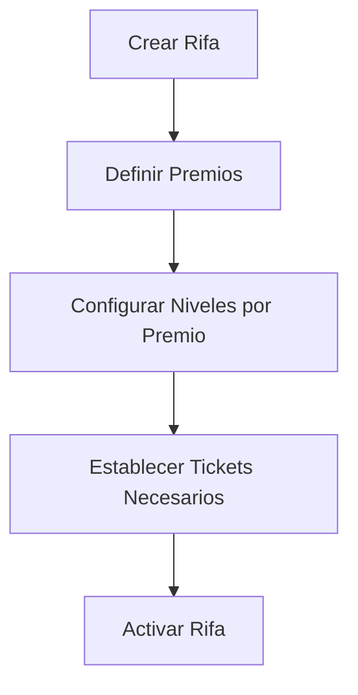
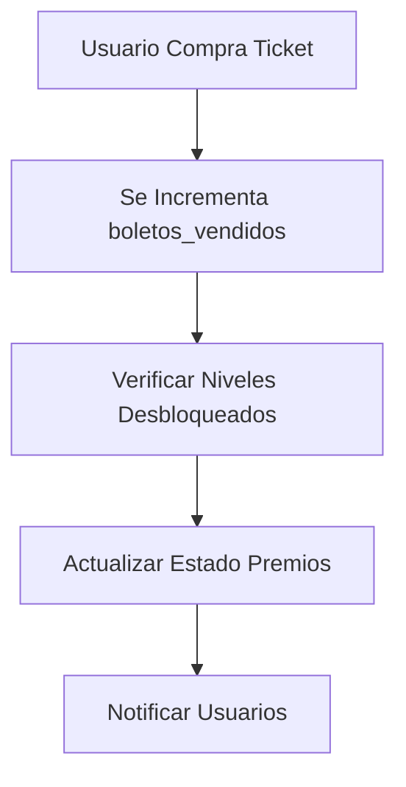

# 🎯 Danilore Rifas - Sistema de Rifas Online

Sistema completo de rifas online con **premios progresivos** usando Laravel + Vue.js + MySQL con Docker.

## 📋 Descripción del Sistema

**Danilore Rifas** es una plataforma de rifas online con un innovador sistema de **premios progresivos** donde los usuarios pueden desbloquear diferentes premios a medida que se venden más tickets. Cada rifa puede tener múltiples premios con niveles que se van desbloqueando progresivamente.

### 🎮 Características Principales

- **Sistema de Premios Progresivos**: Los premios se desbloquean según la cantidad de tickets vendidos
- **Niveles por Premio**: Cada premio tiene niveles que se van completando gradualmente
- **Galería Multimedia**: Soporte para imágenes y videos de alta calidad
- **Pagos Integrados**: Yape, Plin, transferencias bancarias
- **Dashboard Administrativo**: Panel completo para gestión de rifas
- **Notificaciones en Tiempo Real**: Email, SMS y WhatsApp
- **Sistema de Auditoría**: Registro completo de todas las acciones
- **Autenticación JWT**: Laravel Sanctum para seguridad API
- **Panel Admin Completo**: Gestión de rifas, usuarios, ventas y reportes
- **Responsive Design**: Optimizado para desktop, tablet y móvil


## **Sistema de Premios Multinivel:**

1. **Rifa Principal** → Tiene múltiples premios que se desbloquean progresivamente
2. **Cada Premio** → Tiene sus propios niveles (1, 2, 3, etc.)
3. **Al completar todos los niveles de un premio** → Se desbloquea el siguiente premio
4. **Cada nuevo premio desbloqueado** → Tiene sus propios niveles desde cero


## 🎮 Cómo Funciona el Sistema

### **Concepto de Premios Progresivos**

El sistema funciona con un **modelo de premios progresivos** donde:

1. **Una rifa tiene múltiples premios** (Ej: p1, p2, p3)
2. **Cada premio tiene múltiples niveles** (Ej: n1, n2, n3)
3. **Los premios se desbloquean secuencialmente** según los tickets vendidos
4. **Los niveles dentro de un premio se completan gradualmente**

### **Ejemplo Práctico: Rifa PlayStation 5**

```
🎰 RIFA: PlayStation 5 y Accesorios
├── 🏆 Premio 1: Accesorios Gaming (p1)
│   ├── 📦 Nivel 1: Auriculares Gaming (20 tickets)
│   └── 📦 Nivel 2: Control Adicional (30 tickets)
├── 🏆 Premio 2: Juegos Exclusivos (p2) [Requiere p1 completado]
│   ├── 📦 Nivel 1: God of War (40 tickets)
│   ├── 📦 Nivel 2: Spider-Man 2 (50 tickets)
│   └── 📦 Nivel 3: The Last of Us (60 tickets)
└── 🏆 Premio 3: PlayStation 5 Console (p3) [Requiere p2 completado]
    ├── 📦 Nivel 1: Console Estándar (70 tickets)
    └── 📦 Nivel 2: Bundle Completo (75 tickets)
```

### **Flujo de Desbloqueo**

1. **0-19 tickets**: Todos los premios bloqueados
2. **20 tickets**: Se desbloquea Auriculares Gaming (p1-n1)
3. **30 tickets**: Se completa Control Adicional (p1-n2) → Premio 1 completado
4. **40 tickets**: Se desbloquea God of War (p2-n1)
5. **50 tickets**: Se desbloquea Spider-Man 2 (p2-n2)
6. **60 tickets**: Se completa The Last of Us (p2-n3) → Premio 2 completado
7. **70 tickets**: Se desbloquea PlayStation 5 (p3-n1)
8. **75 tickets**: Se completa Bundle Completo (p3-n2) → **RIFA CONFIRMADA**


## 🗄️ Estructura de la Base de Datos

### � **Tipos de Documento Soportados**

El sistema soporta múltiples tipos de documentos para hacerlo internacional y flexible:

- **DNI**: Documento Nacional de Identidad (Perú) - 8 dígitos
- **CE**: Carné de Extranjería (Perú) - Hasta 20 caracteres
- **Passport**: Pasaporte internacional - Hasta 20 caracteres  
- **RUC**: Registro Único de Contribuyentes (empresas) - 11 dígitos
- **Otros**: Otros tipos de documento no especificados

### �👤 **Tabla: `users`**
```sql
- id (BIGINT, PK)
- name (VARCHAR)
- email (VARCHAR, UNIQUE)
- password (VARCHAR)
- telefono (VARCHAR, 15)
- tipo_documento (ENUM: dni, ce, passport, ruc, otros) DEFAULT 'dni'
- numero_documento (VARCHAR, 20)
- fecha_nacimiento (DATE)
- genero (ENUM: masculino, femenino, otro)
- direccion (VARCHAR)
- ciudad (VARCHAR, 100)
- departamento (VARCHAR, 100)
- codigo_postal (VARCHAR, 10)
- rol (ENUM: admin, usuario) DEFAULT 'usuario'
- activo (BOOLEAN) DEFAULT true
- ultimo_acceso (DATETIME)
- avatar (VARCHAR)
- notif_email (BOOLEAN) DEFAULT true
- notif_sms (BOOLEAN) DEFAULT false
- notif_whatsapp (BOOLEAN) DEFAULT true
- total_boletos_comprados (INT) DEFAULT 0
- total_gastado (DECIMAL 12,2) DEFAULT 0
- rifas_ganadas (INT) DEFAULT 0
- timestamps
```

### 🎰 **Tabla: `rifas`**
```sql
- id (BIGINT, PK)
- titulo (VARCHAR)
- descripcion (TEXT)
- precio_boleto (DECIMAL 10,2)
- boletos_minimos (INT) # Tickets mínimos para confirmar la rifa
- boletos_maximos (INT) # Tickets máximos (null = sin límite)
- boletos_vendidos (INT) DEFAULT 0
- imagen_principal (VARCHAR)
- imagenes_adicionales (JSON)
- media_gallery (JSON) # Múltiples medios
- fecha_inicio (DATE)
- fecha_fin (DATE)
- fecha_sorteo (DATETIME)
- estado (ENUM: borrador,activa,bloqueada,pausada,finalizada,cancelada) DEFAULT 'borrador'
- tipo (ENUM: actual, futura) DEFAULT 'futura'
- categoria_id (BIGINT, FK)
- codigo_unico (VARCHAR, 20, UNIQUE)
- es_destacada (BOOLEAN) DEFAULT false
- max_boletos_por_persona (INT) DEFAULT 10
- terminos_condiciones (TEXT)
- orden (INT) DEFAULT 1 # Para ordenar rifas futuras
- rifa_requerida_id (BIGINT, FK) # Rifa que debe completarse antes
- notas_admin (TEXT)
- timestamps
```

### 🏆 **Tabla: `premios`**
```sql
- id (BIGINT, PK)
- rifa_id (BIGINT, FK)
- codigo (VARCHAR, 10) # p1, p2, p3, etc.
- titulo (VARCHAR)
- descripcion (TEXT)
- imagen_principal (VARCHAR)
- media_gallery (JSON) # Imágenes y videos adicionales
- orden (INT) # Orden del premio (1, 2, 3...)
- premio_requerido_id (BIGINT, FK) # Premio que debe completarse antes
- estado (ENUM: bloqueado, activo, completado) DEFAULT 'bloqueado'
- desbloqueado (BOOLEAN) DEFAULT false
- fecha_desbloqueo (DATETIME)
- fecha_completado (DATETIME)
- notas_admin (TEXT)
- timestamps
```

### 📊 **Tabla: `niveles`**
```sql
- id (BIGINT, PK)
- premio_id (BIGINT, FK)
- codigo (VARCHAR, 10) # n1, n2, n3, etc.
- titulo (VARCHAR)
- descripcion (TEXT)
- tickets_necesarios (INT) # Tickets necesarios para desbloquear
- valor_aproximado (DECIMAL 12,2) # Valor estimado del nivel
- imagen (VARCHAR)
- media_gallery (JSON) # Imágenes y videos adicionales
- orden (INT) # Orden dentro del premio (1, 2, 3...)
- desbloqueado (BOOLEAN) DEFAULT false
- es_actual (BOOLEAN) DEFAULT false # Si es el nivel activo actualmente
- fecha_desbloqueo (DATETIME)
- especificaciones (TEXT) # JSON con especificaciones técnicas
- timestamps
```

### 🛒 **Tabla: `ventas`**
```sql
- id (BIGINT, PK)
- user_id (BIGINT, FK)
- rifa_id (BIGINT, FK)
- codigo_venta (VARCHAR, 20, UNIQUE)
- cantidad_boletos (INT)
- subtotal (DECIMAL 12,2)
- descuento (DECIMAL 12,2) DEFAULT 0
- total (DECIMAL 12,2)
- estado (ENUM: pendiente, pagada, cancelada, expirada) DEFAULT 'pendiente'
- metodo_pago (ENUM: yape, plin, transferencia, efectivo)
- fecha_expiracion (DATETIME) # Para reservas temporales
- notas_cliente (TEXT)
- notas_admin (TEXT)
- comprador_nombre (VARCHAR)
- comprador_email (VARCHAR)
- comprador_telefono (VARCHAR)
- comprador_tipo_documento (ENUM: dni, ce, passport, ruc, otros) DEFAULT 'dni'
- comprador_numero_documento (VARCHAR, 20)
- referencia_pago (VARCHAR)
- fecha_pago (DATETIME)
- monto_pagado (DECIMAL 12,2)
- comprobante_pago (VARCHAR) # URL del comprobante
- timestamps
```

### 🎫 **Tabla: `boletos`**
```sql
- id (BIGINT, PK)
- rifa_id (BIGINT, FK)
- user_id (BIGINT, FK)
- venta_id (BIGINT, FK)
- numero (VARCHAR, 10) # Número del boleto
- precio_pagado (DECIMAL 10,2)
- estado (ENUM: reservado, pagado, cancelado) DEFAULT 'reservado'
- fecha_reserva (DATETIME)
- fecha_expiracion_reserva (DATETIME)
- fecha_pago (DATETIME)
- codigo_verificacion (VARCHAR, 50, UNIQUE)
- es_ganador (BOOLEAN) DEFAULT false
- timestamps
```

### 💳 **Tabla: `pagos`**
```sql
- id (BIGINT, PK)
- venta_id (BIGINT, FK)
- metodo_pago (VARCHAR) # yape, plin, transferencia, efectivo
- monto (DECIMAL 12,2)
- referencia_externa (VARCHAR) # ID de transacción del banco/app
- numero_operacion (VARCHAR)
- fecha_transaccion (DATETIME)
- estado (ENUM: pendiente, verificado, rechazado) DEFAULT 'pendiente'
- comprobante_url (VARCHAR) # URL del comprobante subido
- notas_verificacion (TEXT)
- verificado_por (BIGINT, FK) # Admin que verificó
- fecha_verificacion (DATETIME)
- datos_pago (JSON) # Datos específicos según el método
- timestamps
```

### 🏷️ **Tabla: `categorias`**
```sql
- id (BIGINT, PK)
- nombre (VARCHAR, 100)
- slug (VARCHAR, 100, UNIQUE)
- descripcion (TEXT)
- icono (VARCHAR, 50)
- color (VARCHAR, 7) DEFAULT '#8B5CF6'
- activa (BOOLEAN) DEFAULT true
- orden (INT) DEFAULT 0
- timestamps
```

### 🔧 **Tabla: `configuraciones`**
```sql
- id (BIGINT, PK)
- clave (VARCHAR, 100, UNIQUE)
- valor (TEXT)
- tipo (VARCHAR, 50) DEFAULT 'string' # string, number, boolean, json
- grupo (VARCHAR, 50) # general, pagos, notificaciones, etc.
- descripcion (TEXT)
- editable (BOOLEAN) DEFAULT true
- timestamps
```

### 🔔 **Tabla: `notificaciones`**
```sql
- id (BIGINT, PK)
- user_id (BIGINT, FK)
- titulo (VARCHAR)
- mensaje (TEXT)
- tipo (ENUM: info, success, warning, error) DEFAULT 'info'
- canal (ENUM: sistema, email, sms, whatsapp) DEFAULT 'sistema'
- datos_adicionales (JSON) # Para datos específicos como rifa_id, venta_id, etc.
- leida (BOOLEAN) DEFAULT false
- fecha_leida (DATETIME)
- enviada (BOOLEAN) DEFAULT false
- fecha_envio (DATETIME)
- error_envio (TEXT)
- referencia_externa (VARCHAR) # ID del servicio de envío
- timestamps
```

### 📈 **Tabla: `progreso_premios`**
```sql
- id (BIGINT, PK)
- premio_id (BIGINT, FK)
- nivel_id (BIGINT, FK) # NULL si es progreso general del premio
- tickets_actuales (INT) DEFAULT 0
- tickets_objetivo (INT)
- porcentaje_completado (DECIMAL 5,2) DEFAULT 0 # 0.00 - 100.00
- objetivo_alcanzado (BOOLEAN) DEFAULT false
- fecha_alcanzado (DATETIME)
- ultimo_ticket (DATETIME) # Fecha del último ticket que contribuyó
- tickets_restantes (VIRTUAL) # tickets_objetivo - tickets_actuales
- timestamps
```

### 🕵️ **Tabla: `auditoria`**
```sql
- id (BIGINT, PK)
- tabla_afectada (VARCHAR) # Nombre de la tabla
- accion (VARCHAR) # INSERT, UPDATE, DELETE
- registro_id (BIGINT) # ID del registro afectado
- user_id (BIGINT, FK) # Usuario que realizó la acción
- datos_anteriores (JSON) # Datos antes del cambio
- datos_nuevos (JSON) # Datos después del cambio
- ip_address (VARCHAR, 45) # IP del usuario
- user_agent (VARCHAR) # Navegador del usuario
- observaciones (TEXT) # Comentarios adicionales
- timestamps
```

## 🏗️ Arquitectura del Sistema

### **Frontend (Vue.js 3)**
```
frontend/
├── src/
│   ├── components/          # Componentes reutilizables
│   │   ├── AppHeader.vue
│   │   ├── AppFooter.vue
│   │   ├── MediaGallery.vue
│   │   └── ProgressBar.vue
│   ├── views/               # Páginas principales
│   │   ├── Home.vue
│   │   ├── RifaDetail.vue
│   │   ├── PremioDetail.vue
│   │   ├── Dashboard.vue
│   │   └── Login.vue
│   ├── composables/         # Lógica reutilizable
│   │   ├── useRifaDetail.js
│   │   └── useAuth.js
│   ├── services/            # Servicios API
│   │   └── rifaService.js
│   ├── store/               # Estado global
│   │   └── auth.js
│   ├── router/              # Configuración de rutas
│   │   └── index.js
│   └── utils/               # Utilidades
│       └── helpers.js
```

### **Backend (Laravel 12)**
```
backend/
├── app/
│   ├── Http/Controllers/    # Controladores API
│   │   ├── RifaController.php
│   │   ├── PremioController.php
│   │   ├── VentaController.php
│   │   └── AuthController.php
│   ├── Models/              # Modelos Eloquent
│   │   ├── Rifa.php
│   │   ├── Premio.php
│   │   ├── Nivel.php
│   │   ├── Venta.php
│   │   ├── Boleto.php
│   │   └── User.php
│   ├── Services/            # Lógica de negocio
│   │   ├── RifaService.php
│   │   ├── PagoService.php
│   │   └── NotificationService.php
│   └── Observers/           # Observadores para auditoría
├── database/
│   ├── migrations/          # Migraciones de BD
│   └── seeders/             # Datos iniciales
└── routes/
    └── api.php              # Rutas API
```

## � Flujo del Sistema de Premios Progresivos

### **1. Configuración de Rifa**


### **2. Proceso de Venta**


### **3. Estados de Premio**
- **Bloqueado**: No se han vendido suficientes tickets
- **Activo**: Tickets suficientes para el nivel actual
- **Completado**: Todos los niveles completados

## 🚀 Funcionalidades Implementadas

### **Frontend (Vue.js 3)**
- ✅ **Home**: Vista principal con rifas activas y futuras
- ✅ **RifaDetail**: Detalle de rifa con premios progresivos
- ✅ **PremioDetail**: Vista individual de cada premio
- ✅ **MediaGallery**: Galería multimedia responsiva
- ✅ **Sistema de Pagos**: Integración con Yape/Plin
- ✅ **Autenticación**: Login/Register con persistencia
- ✅ **Dashboard**: Panel de usuario con historial
- ✅ **Admin Panel**: Panel administrativo completo
- ✅ **Responsive Design**: Optimizado para móviles

### **Backend (Laravel 12)**
- ✅ **API REST**: Endpoints para todas las funcionalidades
- ✅ **Autenticación**: Laravel Sanctum con JWT
- ✅ **Sistema de Premios**: Lógica de desbloqueo progresivo
- ✅ **Gestión de Pagos**: Verificación y procesamiento
- ✅ **Dashboard Admin**: Panel administrativo completo
- ✅ **Gestión de Rifas**: CRUD completo con validaciones
- ✅ **Gestión de Usuarios**: Control de roles y permisos
- ✅ **Reportes y Estadísticas**: Analytics en tiempo real
- ✅ **Upload de Archivos**: Gestión de imágenes y medios
- ✅ **Auditoría**: Registro de todas las acciones

## 🚀 API Endpoints

### **Base URL**: `http://localhost:8000/api/v1`

### 🔓 **Endpoints Públicos**

#### **Autenticación**
```http
POST /auth/register          # Registro de usuario
POST /auth/login             # Iniciar sesión
```

**Ejemplo de registro:**
```json
POST /api/v1/auth/register
{
  "name": "Juan Pérez",
  "email": "juan@email.com",
  "password": "12345678",
  "password_confirmation": "12345678",
  "telefono": "+51987654321",
  "tipo_documento": "dni",
  "numero_documento": "12345678",
  "fecha_nacimiento": "1990-01-01",
  "genero": "masculino"
}
```

**Respuesta:**
```json
{
  "success": true,
  "message": "Usuario registrado correctamente",
  "data": {
    "user": {
      "id": 1,
      "name": "Juan Pérez",
      "email": "juan@email.com",
      "telefono": "+51987654321",
      "tipo_documento": "dni",
      "numero_documento": "12345678",
      "rol": "usuario",
      "activo": true
    },
    "token": "1|abc123..."
  }
}
```

**Ejemplo de login:**
```json
POST /api/v1/auth/login
{
  "email": "juan@email.com",
  "password": "12345678"
}
```

**Respuesta:**
```json
{
  "success": true,
  "message": "Login exitoso",
  "data": {
    "user": { ... },
    "token": "1|xyz789..."
  }
}
```

#### **Rifas**
```http
GET /rifas                   # Listar todas las rifas
GET /rifas/actuales         # Rifas en venta
GET /rifas/futuras          # Rifas por venir  
GET /rifas/destacadas       # Rifas destacadas
GET /rifas/{codigo}         # Detalle de rifa
GET /rifas/{codigo}/progreso # Progreso de premios
```

**Parámetros de consulta:**
- `categoria_id`: Filtrar por categoría
- `tipo`: `actual` o `futura`
- `estado`: `activa`, `borrador`, `pausada`, `finalizada`, `cancelada`
- `destacadas`: `true` para rifas destacadas
- `per_page`: Número de resultados por página (default: 15)

**Ejemplo:**
```http
GET /api/v1/rifas/actuales?categoria_id=1&per_page=10
```

**Respuesta:**
```json
{
  "success": true,
  "data": {
    "current_page": 1,
    "data": [
      {
        "id": 1,
        "titulo": "iPhone 15 Pro Max",
        "codigo_unico": "IPHONE15PM001",
        "precio_boleto": "10.00",
        "boletos_vendidos": 35,
        "boletos_minimos": 100,
        "boletos_maximos": null,
        "porcentaje_completado": 35.0,
        "estado": "activa",
        "tipo": "actual",
        "categoria": {
          "id": 1,
          "nombre": "Tecnología",
          "slug": "tecnologia"
        },
        "premios": [
          {
            "id": 1,
            "codigo": "p1",
            "titulo": "AirPods Pro",
            "estado": "activo",
            "niveles": [
              {
                "id": 1,
                "codigo": "n1",
                "titulo": "AirPods Pro 2da Gen",
                "tickets_necesarios": 20,
                "desbloqueado": true,
                "es_actual": false
              }
            ]
          }
        ]
      }
    ],
    "total": 5,
    "per_page": 10,
    "current_page": 1,
    "last_page": 1
  }
}
```

#### **Categorías**
```http
GET /categorias             # Listar categorías activas
```

**Respuesta:**
```json
{
  "success": true,
  "data": [
    {
      "id": 1,
      "nombre": "Tecnología",
      "slug": "tecnologia",
      "descripcion": "Productos tecnológicos y gadgets",
      "icono": "fas fa-laptop",
      "color": "#3B82F6",
      "rifas_count": 5
    }
  ]
}
```

#### **Premios**
```http
GET /premios/{rifaCodigoUnico}/{codigoPremio} # Detalle del premio
```

#### **Consulta de Ventas**
```http
GET /ventas/{codigo}        # Consultar venta por código
```

### 🔐 **Endpoints Autenticados**
*Requieren header: `Authorization: Bearer {token}`*

#### **Perfil de Usuario**
```http
POST /auth/logout           # Cerrar sesión
GET /auth/profile          # Obtener perfil
PUT /auth/profile          # Actualizar perfil
```

**Ejemplo actualizar perfil:**
```json
PUT /api/v1/auth/profile
{
  "name": "Juan Carlos Pérez",
  "telefono": "+51987654321",
  "direccion": "Av. Lima 123",
  "ciudad": "Lima",
  "departamento": "Lima"
}
```

#### **Ventas**
```http
POST /ventas               # Crear nueva venta (reservar boletos)
POST /ventas/{codigo}/confirmar-pago # Subir comprobante
GET /ventas/mis-ventas     # Mis compras
```

**Ejemplo de compra:**
```json
POST /api/v1/ventas
{
  "rifa_codigo": "IPHONE15PM001",
  "numeros_boletos": ["0001", "0025", "0100"],
  "comprador_nombre": "Juan Pérez",
  "comprador_email": "juan@email.com", 
  "comprador_telefono": "+51987654321",
  "comprador_tipo_documento": "dni",
  "comprador_numero_documento": "12345678",
  "metodo_pago": "yape"
}
```

**Respuesta:**
```json
{
  "success": true,
  "message": "Venta creada correctamente",
  "data": {
    "codigo_venta": "VT20250801ABC123",
    "total": "30.00",
    "fecha_expiracion": "2025-08-01T10:15:00Z",
    "boletos": [
      {
        "numero": "0001",
        "codigo_verificacion": "A1B2C3D4E5"
      },
      {
        "numero": "0025",
        "codigo_verificacion": "B2C3D4E5F6"
      },
      {
        "numero": "0100",
        "codigo_verificacion": "C3D4E5F6G7"
      }
    ],
    "tiempo_restante": 900
  }
}
```

**Confirmar pago:**
```http
POST /api/v1/ventas/VT20250801ABC123/confirmar-pago
Content-Type: multipart/form-data

numero_operacion: "123456789"
monto_pagado: "30.00"
comprobante: [archivo imagen]
```

### 🔧 **Endpoints Administrativos**
*Requieren autenticación + rol admin*

#### **Dashboard Admin**
```http
GET /admin/dashboard/stats     # Estadísticas generales
GET /admin/activity/recent     # Actividad reciente
```

#### **Gestión de Rifas**
```http
GET /admin/rifas              # Lista para admin
POST /admin/rifas             # Crear rifa
PUT /admin/rifas/{id}         # Actualizar rifa
DELETE /admin/rifas/{id}      # Eliminar rifa
PATCH /admin/rifas/{id}/estado # Cambiar estado
GET /admin/rifas/exportar     # Exportar datos
```

#### **Gestión de Usuarios**
```http
GET /admin/usuarios           # Lista usuarios
POST /admin/usuarios          # Crear usuario
PUT /admin/usuarios/{id}      # Actualizar usuario
DELETE /admin/usuarios/{id}   # Eliminar usuario
```

#### **Reportes y Ventas**
```http
GET /admin/ventas             # Lista ventas
GET /admin/ventas/reportes    # Reportes de ventas
```

#### **Upload de Archivos**
```http
POST /upload/rifa-image       # Subir imagen de rifa
POST /upload/premio-image     # Subir imagen de premio
POST /upload/nivel-image      # Subir imagen de nivel
DELETE /upload/image          # Eliminar imagen
```

### 📊 **Códigos de Respuesta**

- `200` - OK: Operación exitosa
- `201` - Created: Recurso creado
- `401` - Unauthorized: Token inválido o expirado
- `403` - Forbidden: Sin permisos
- `404` - Not Found: Recurso no encontrado
- `409` - Conflict: Números ya ocupados
- `410` - Gone: Venta expirada
- `422` - Validation Error: Datos incorrectos
- `500` - Server Error: Error interno

### 🔒 **Autenticación**

El sistema usa **Laravel Sanctum** para autenticación API:

1. **Registro/Login** → Recibir token
2. **Incluir en headers**: `Authorization: Bearer {token}`
3. **Token expira** cuando el usuario hace logout

### ⚡ **Características Avanzadas**

- **Reserva temporal**: Números reservados por 15 minutos
- **Verificación en tiempo real**: Disponibilidad de números
- **Upload de archivos**: Comprobantes de pago e imágenes
- **Paginación automática**: En listados
- **Filtros avanzados**: Por categoría, estado, etc.
- **Relaciones optimizadas**: Carga eager loading
- **Validaciones robustas**: En todos los endpoints
- **Panel Admin Completo**: Gestión total del sistema
- **Reportes en Tiempo Real**: Analytics y estadísticas
- **Sistema de Roles**: Control de permisos granular
- **Middleware de Seguridad**: Protección de rutas admin
- **Estados de Rifa**: Borrador, activa, bloqueada, pausada, finalizada, cancelada
- **Gestión de Media**: Upload y organización de imágenes/videos

### **Frontend Implementado**
- ✅ **Autenticación**: Login/Register con persistencia
- ✅ **Dashboard**: Panel de usuario con historial
- ✅ **Panel Admin**: Gestión completa de rifas y usuarios
- ✅ **Responsive Design**: Optimizado para móviles
- ✅ **Router Guards**: Protección de rutas
- ✅ **State Management**: Manejo de estado global
- ✅ **Error Handling**: Manejo de errores avanzado

### **Backend Avanzado**
- ✅ **API REST**: Endpoints para todas las funcionalidades
- ✅ **Sistema de Premios**: Lógica de desbloqueo progresivo
- ✅ **Gestión de Pagos**: Verificación y procesamiento
- ✅ **Notificaciones**: Email, SMS y WhatsApp (preparado)
- ✅ **Auditoría**: Registro de todas las acciones
- ✅ **Dashboard Admin**: Panel administrativo completo
- ✅ **Middleware Personalizado**: AdminMiddleware para seguridad
- ✅ **Validaciones Avanzadas**: Request validation en todos los endpoints
- ✅ **Manejo de Estados**: Estados complejos de rifas y premios

## 🔐 Seguridad y Validaciones

### **Frontend**
- Validación de formularios con Vue 3
- Sanitización de datos de entrada
- Control de acceso por roles
- Persistencia segura en localStorage

### **Backend**
- Validación de datos con Laravel Request
- Middleware de autenticación JWT
- Rate limiting en APIs
- Auditoría completa de acciones
- Encriptación de datos sensibles

## 📱 Responsive Design

El sistema está optimizado para:
- **Desktop**: 1200px+ (Grid 2fr 1fr)
- **Tablet**: 769px-1199px (Grid compacto)
- **Mobile**: ≤768px (Layout en columna única)

## 🚀 Instalación y Configuración

### Pre-requisitos
- **Docker Desktop** (Windows/Mac/Linux)
- **Docker Compose** v2.0+
- **Git** para clonar el repositorio
- **4GB RAM mínimo** para los contenedores
- **Puertos disponibles**: 3000 (Frontend), 8000 (Backend), 3306 (MySQL)

### 🔧 Configuración Inicial

1. **Clonar el repositorio:**
```bash
git clone https://github.com/TheDanilore/danilore-rifas.git
cd danilore-rifas
```

2. **Configurar variables de entorno (backend):**
```bash
# Navegar al directorio backend
cd backend

# Copiar el archivo de configuración
cp .env.example .env

# Editar el archivo .env con tu configuración
# Las variables importantes ya están configuradas para Docker
```

**Variables de entorno clave en `.env`:**
```env
APP_NAME="Danilore Rifas"
APP_ENV=local
APP_KEY=base64:... # Se genera automáticamente
APP_DEBUG=true
APP_URL=http://localhost:8000

DB_CONNECTION=mysql
DB_HOST=mysql
DB_PORT=3306
DB_DATABASE=danilore_rifas
DB_USERNAME=danilore
DB_PASSWORD=danilore123

# Laravel Sanctum para autenticación
SANCTUM_STATEFUL_DOMAINS=localhost:3000,127.0.0.1:3000
SESSION_DOMAIN=localhost

# Configuración de archivos
FILESYSTEM_DISK=local
```

3. **Construir y levantar los servicios:**
```bash
# Volver al directorio raíz
cd ..

# Construir y levantar todos los servicios
docker-compose up --build -d
```

4. **Instalar dependencias del backend:**
```bash
# Instalar dependencias de Composer
docker exec danilore_backend composer install

# Generar clave de la aplicación
docker exec danilore_backend php artisan key:generate

# Generar enlace simbólico para storage
docker exec danilore_backend php artisan storage:link
```

5. **Configurar la base de datos:**
```bash
# Ejecutar migraciones
docker exec danilore_backend php artisan migrate

# Ejecutar seeders (datos de prueba)
docker exec danilore_backend php artisan db:seed
```

6. **Configurar el frontend:**
```bash
# Instalar dependencias de Node.js
docker exec danilore_frontend npm install

# Compilar assets para desarrollo
docker exec danilore_frontend npm run serve
```

### 📊 Servicios Disponibles

| Servicio | Puerto | URL | Descripción |
|----------|--------|-----|-------------|
| **Frontend** (Vue.js) | 3000 | http://localhost:3000 | Aplicación web principal |
| **Backend** (Laravel) | 8000 | http://localhost:8000 | API REST y admin |
| **MySQL** | 3306 | localhost:3306 | Base de datos |
| **PHPMyAdmin** | 8080 | http://localhost:8080 | Administrador de BD |

### 🗄️ Acceso a la Base de Datos

#### **Credenciales MySQL:**
- **Host:** localhost (desde host) / mysql (desde contenedores)
- **Puerto:** 3306
- **Base de datos:** danilore_rifas
- **Usuario:** danilore
- **Contraseña:** danilore123
- **Root Password:** root123

#### **PHPMyAdmin (Opcional):**
Si quieres acceso visual a la base de datos, puedes agregar PHPMyAdmin al `docker-compose.yml`:

```yaml
phpmyadmin:
  image: phpmyadmin/phpmyadmin
  container_name: danilore_phpmyadmin
  environment:
    PMA_HOST: mysql
    PMA_USER: danilore
    PMA_PASSWORD: danilore123
  ports:
    - "8080:80"
  depends_on:
    - mysql
  networks:
    - danilore_network
```

### 🛠️ Comandos Útiles

#### **Docker Management**
```bash
# Levantar servicios
docker-compose up -d

# Ver logs en tiempo real
docker-compose logs -f

# Ver logs de un servicio específico
docker-compose logs -f backend

# Detener servicios
docker-compose down

# Reconstruir contenedores (después de cambios)
docker-compose up --build -d

# Limpiar volúmenes (CUIDADO: borra la BD)
docker-compose down -v
```

#### **Laravel (Backend)**
```bash
# Ejecutar comandos artisan
docker exec danilore_backend php artisan migrate
docker exec danilore_backend php artisan db:seed
docker exec danilore_backend php artisan cache:clear
docker exec danilore_backend php artisan config:clear
docker exec danilore_backend php artisan route:clear

# Crear migraciones
docker exec danilore_backend php artisan make:migration create_nueva_tabla

# Crear controladores
docker exec danilore_backend php artisan make:controller NuevoController

# Acceder al contenedor
docker exec -it danilore_backend bash

# Ver rutas API
docker exec danilore_backend php artisan route:list --path=api
```

#### **Vue.js (Frontend)**
```bash
# Instalar nuevas dependencias
docker exec danilore_frontend npm install paquete-nuevo

# Ejecutar en modo desarrollo con hot-reload
docker exec danilore_frontend npm run serve

# Compilar para producción
docker exec danilore_frontend npm run build

# Linting de código
docker exec danilore_frontend npm run lint

# Acceder al contenedor
docker exec -it danilore_frontend sh
```

#### **Base de Datos**
```bash
# Conectar a MySQL desde línea de comandos
docker exec -it danilore_mysql mysql -u danilore -p danilore_rifas

# Hacer backup de la base de datos
docker exec danilore_mysql mysqldump -u danilore -p danilore_rifas > backup.sql

# Restaurar backup
docker exec -i danilore_mysql mysql -u danilore -p danilore_rifas < backup.sql

# Ver logs de MySQL
docker logs danilore_mysql
```

### 🔍 Verificación de la Instalación

1. **Verificar que todos los servicios estén corriendo:**
```bash
docker-compose ps
```

2. **Probar el backend:**
```bash
curl http://localhost:8000/api/v1/categorias
```

3. **Acceder al frontend:**
Abrir http://localhost:3000 en el navegador

4. **Probar autenticación:**
- Registrar nuevo usuario en http://localhost:3000/register
- Hacer login en http://localhost:3000/login
- Acceder al admin en http://localhost:3000/admin (user: admin@danilore.com, pass: admin123)

### 🐛 Solución de Problemas

#### **Puerto ya en uso:**
```bash
# Verificar qué usa el puerto
netstat -ano | findstr :3000
netstat -ano | findstr :8000

# Cambiar puertos en docker-compose.yml si es necesario
```

#### **Problemas de permisos (Linux/Mac):**
```bash
# Dar permisos a los directorios de Laravel
sudo chown -R $USER:$USER backend/storage
sudo chown -R $USER:$USER backend/bootstrap/cache
```

#### **Limpiar cache de Docker:**
```bash
docker system prune -a
docker volume prune
```

#### **Reiniciar base de datos:**
```bash
# Detener servicios
docker-compose down

# Eliminar volumen de la base de datos
docker volume rm danilore-rifas_mysql_data

# Levantar servicios y ejecutar migraciones
docker-compose up -d
docker exec danilore_backend php artisan migrate
docker exec danilore_backend php artisan db:seed
```

### 📱 Modo Desarrollo vs Producción

#### **Desarrollo (Actual):**
- Hot-reload habilitado
- Debug mode activado
- CORS configurado para localhost
- Logs detallados

#### **Para Producción:**
```bash
# Backend
APP_ENV=production
APP_DEBUG=false

# Frontend
npm run build

# Configurar dominio real y SSL
```


### � **Credenciales por Defecto**

#### **Base de Datos MySQL:**
- **Host:** localhost:3306 (desde host) / mysql:3306 (desde contenedores)
- **Database:** danilore_rifas
- **Usuario:** danilore
- **Contraseña:** danilore123
- **Root Password:** root123

#### **Usuario Admin por Defecto:**
- **Email:** admin@danilore.com
- **Contraseña:** admin123
- **Rol:** Administrador
- **Acceso:** http://localhost:3000/admin

#### **Usuario de Prueba:**
- **Email:** usuario@test.com
- **Contraseña:** 12345678
- **Rol:** Usuario regular

## 🎯 API Endpoints Completos (Backend)

### **Base URL**: `http://localhost:8000/api/v1`

### **🔓 Rutas Públicas**
```
POST   /auth/register                    # Registro de usuario
POST   /auth/login                       # Iniciar sesión

GET    /rifas                           # Listar todas las rifas
GET    /rifas/actuales                  # Rifas activas
GET    /rifas/futuras                   # Rifas futuras
GET    /rifas/destacadas                # Rifas destacadas
GET    /rifas/{codigo}                  # Detalle de rifa
GET    /rifas/{codigo}/progreso         # Progreso de premios

GET    /categorias                      # Listar categorías activas
GET    /premios/{rifaCode}/{premioCode} # Detalle de premio específico
GET    /ventas/{codigo}                 # Consultar venta por código
```

### **🔐 Rutas Autenticadas** (Requieren `Authorization: Bearer {token}`)
```
POST   /auth/logout                     # Cerrar sesión
GET    /auth/profile                    # Obtener perfil
PUT    /auth/profile                    # Actualizar perfil

POST   /ventas                          # Crear nueva venta
POST   /ventas/{codigo}/confirmar-pago  # Confirmar pago con comprobante
GET    /ventas/mis-ventas               # Historial de compras

POST   /upload/rifa-image               # Subir imagen de rifa
POST   /upload/premio-image             # Subir imagen de premio
POST   /upload/nivel-image              # Subir imagen de nivel
DELETE /upload/image                    # Eliminar imagen
```

### **👑 Rutas de Administración** (Requieren autenticación + rol admin)
```
# Dashboard y Estadísticas
GET    /admin/dashboard/stats           # Estadísticas del dashboard
GET    /admin/activity/recent           # Actividad reciente

# Gestión de Rifas
GET    /admin/rifas                     # Lista rifas para admin
POST   /admin/rifas                     # Crear nueva rifa
PUT    /admin/rifas/{id}               # Actualizar rifa
DELETE /admin/rifas/{id}               # Eliminar rifa
PATCH  /admin/rifas/{id}/estado        # Cambiar estado de rifa
GET    /admin/rifas/estadisticas       # Estadísticas de rifas
GET    /admin/rifas/exportar           # Exportar datos de rifas

# Gestión de Usuarios
GET    /admin/usuarios                  # Lista usuarios
POST   /admin/usuarios                  # Crear nuevo usuario
PUT    /admin/usuarios/{id}            # Actualizar usuario
DELETE /admin/usuarios/{id}            # Eliminar usuario

# Reportes y Ventas
GET    /admin/ventas                    # Lista ventas
GET    /admin/ventas/reportes          # Reportes de ventas

# Gestión de Media
POST   /media/premios/{id}/images       # Subir imagen de premio
DELETE /media/premios/{id}/images       # Eliminar imagen de premio
GET    /media/premios/{id}/images       # Obtener imágenes de premio
PUT    /media/premios/{id}/images/reorder # Reordenar imágenes
```

### **🔧 Información Adicional**
- **Middleware de Admin**: `AdminMiddleware` verifica rol y estado activo
- **Rate Limiting**: Configurado en rutas sensibles
- **CORS**: Habilitado para localhost:3000
- **Validación**: Request validation en todos los endpoints
- **Paginación**: Implementada en listados (default: 15 items)
- **Eager Loading**: Optimización de consultas con relaciones

### **⚠️ Puntos de Atención**
- Los enums deben mantenerse sincronizados entre frontend y backend
- Las validaciones JavaScript deben coincidir con las de Laravel
- Los nombres de campos JSON deben ser consistentes
- Los códigos de premio/nivel deben seguir la convención establecida

## 🚀 Producción

### **Configuración para Producción**

#### **Variables de Entorno (.env)**
```env
APP_ENV=production
APP_DEBUG=false
APP_URL=https://tudomain.com

# Base de datos de producción
DB_HOST=tu-servidor-mysql
DB_DATABASE=danilore_rifas_prod
DB_USERNAME=usuario_prod
DB_PASSWORD=contraseña_segura

# Configurar CORS para dominio real
SANCTUM_STATEFUL_DOMAINS=tudomain.com

# SSL y seguridad
FORCE_HTTPS=true
SESSION_SECURE_COOKIE=true
```

#### **Frontend para Producción**
```bash
# Compilar assets optimizados
docker exec danilore_frontend npm run build

# Configurar URL de API para producción
# Editar frontend/src/config/backend.js
```

#### **Optimizaciones Recomendadas**
- **CDN**: Para imágenes y assets estáticos
- **Redis**: Para cache y sesiones
- **SSL/TLS**: Certificado HTTPS obligatorio
- **Backup Automático**: Base de datos
- **Monitoring**: Logs y métricas
- **Load Balancer**: Para alta disponibilidad

#### **Docker Compose para Producción**
```yaml
# Usar imágenes optimizadas
# Configurar volúmenes persistentes
# Habilitar restart policies
# Configurar networks seguros
```

### **🔒 Seguridad Implementada**

- **Laravel Sanctum**: Autenticación API segura
- **Middleware AdminMiddleware**: Control de acceso administrativo
- **Validación robusta**: En todos los endpoints
- **Hash de contraseñas**: Bcrypt
- **CORS configurado**: Solo dominios permitidos
- **Rate limiting**: Protección contra ataques
- **SQL Injection**: Protección con Eloquent ORM
- **XSS Protection**: Sanitización de datos

---

**Desarrollado para Danilore Rifas** 🎲

- **Desarrollador**: The Danilore
- **Email**: arteagagordillol@gmail.com
- **Versión**: 2.0.0
- **Última actualización**: Agosto 2025